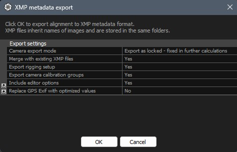
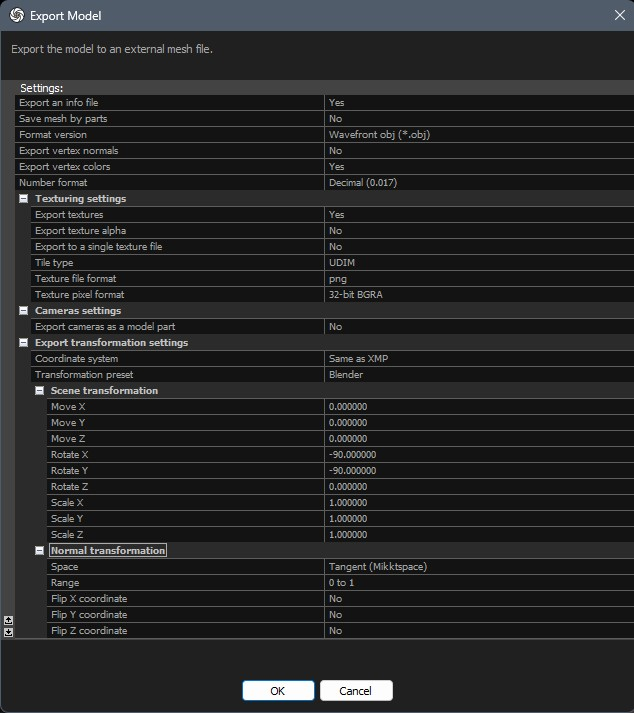

Quick Start
###########

Reality Capture
***************

* **Export camera data**

* **Export mesh model**

Для того щоб спростити собі завдання під час імпорту моделі до Blender, експортуємо модель як Wavefront (.obj) файл. У нових версіях Blender (3.2+) цей тип файлів імпортується швидко і містить лише необхідні для роботи з доповненням дані. Тут важливими опціями є:

    * ``Coordinate System`` - ``Same as XMP``
    * ``Transformation Preset`` - ``Blender``

Їх буде використано :ref:`як попередні налаштування для <Software>` імпорту з Reality Capture під час :doc:`імпорту сцени <./ops/import-scene>`.

